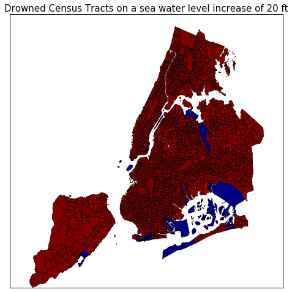

## Drown_NYC

Group members:
- Adriano Yoshino - amy324@nyu.edu
- Akshay Penmatcha - akp418@nyu.edu
- Christian Rosado - cor215@nyu.edu
- Hrafnkell Hjorleifsson - hh1713@nyu.edu

Special thanks to Federica BIanco and Justin Salamon, who challenged us to make this analysis happen.

### Dataset:
- Sea Level historical data: https://tidesandcurrents.noaa.gov/sltrends/sltrends_station.shtml?stnid=8518750
- Elevation map: https://data.cityofnewyork.us/Transportation/Elevation-points/szwg-xci6
- Census Tract data (2010): https://data.cityofnewyork.us/City-Government/2010-Census-Tracts/fxpq-c8ku

### Methodology:
Ideally we want to get the topography map of NYC to start simulating wich areas within NYC would be drowned in case of an arbitrary sea level raising. Due to time limitation, our solution was using an average elevation of each Census Tract, which is much smaller than zipcodes, giving us more precision.
Once with the elevation map, we expected to increasesea level accordingly to expectations of sea level rising by matters of global heating, but the historical increase in sea level was so small that we ended up simulating some hypothetical sea level rising, starting from 6.5 ft up to 120 ft (what sounds impossible, but pretty entertaining as a simulation matter).

### Results:
The results can be observed as the following pictures (just few samples, for more information look at repo):

- Simmulating a sea level increasing by 6.5 ft:

- Simmulating a sea level increasing by 20 ft:

- Simmulating a sea level increasing by 40 ft:

We can see by those plots some not likely but interesting results. Maybe the closest from reality can be found on 6.5 ft plot, level that can be achieved during severe storms, and we noticed something really warning, there are some small islands that can be covered by water.

### Final Considerations
Our study, motivated by the concern of a sea level increase due to global warm event, shows that for NYC being in real danger the sea level has to rise considerably (not to say very very unlikely). Just by matter of curiosity, here's a plot of the sea level increase from 1850 to 2015, the increase a year is on average 2.83 mm/year.

